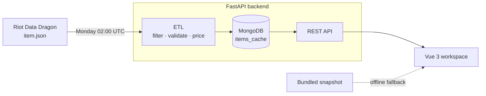

# BuildValue

[](https://github.com/Chrisdalbano/valuebuild-web/actions/workflows/ci.yml)

What are a League of Legends item's stats worth in gold?

BuildValue pulls Riot's item data every week, prices each item's base stats against the game's own reference items, and lets you search, compare and plan builds with those numbers.

**[Open BuildValue](https://buildvalue.chrisdalbano.com)** · Vue 3 + TypeScript front end · FastAPI + MongoDB back end · weekly ETL on Riot's Data Dragon

## How it works



1. **Extract.** A scheduled job reads the latest patch's `item.json` from Data Dragon.
2. **Filter.** Only items a player can buy on Summoner's Rift are kept: no Arena or ARAM copies, no removed items ([`etl/item_filters.py`](backend/etl/item_filters.py), [`etl/deprecated_items.py`](backend/etl/deprecated_items.py)).
3. **Price.** Each base stat is valued from a reference item, and the item's efficiency is that value divided by its cost ([`efficiency.py`](backend/efficiency.py)).
4. **Load.** Results are upserted into MongoDB. Items that disappeared are flagged, not deleted, and a run that comes back much smaller than the last one retires nothing.
5. **Serve.** The API reads from the cache. The front end also ships a captured, patch-labelled snapshot so the workspace still opens when the API is asleep or unreachable.

### The formula

| Stat | Reference item | Gold per point |
|---|---|---|
| Attack damage | Long Sword (10 AD, 350g) | 35 |
| Ability power | Amplifying Tome (20 AP, 400g) | 20 |
| Armor | Cloth Armor (15, 300g) | 20 |
| Magic resist | Null-Magic Mantle (20, 400g) | 20 |
| Health | Ruby Crystal (150, 400g) | 2.67 |
| Ability haste | Glowing Mote (5, 250g) | 50 |

`efficiency = sum(stat amount × gold per point) / item cost`

A Long Sword is 100% by definition. The full table is in [`efficiency.py`](backend/efficiency.py).

### What the number does not tell you

Gold efficiency prices base stats only. It does not price passives, actives, penetration or champion interactions, simulate combat, or predict win rates. An effect-heavy item reads low because its effect is unpriced, not because it is bad. The budget planner maximizes this stat-value model, not in-game performance. AI-generated studies are labelled as speculative and kept separate from calculated totals.

## Bugs that shaped the rules

Each of these was a real defect in the tool and now has a regression test.

| What went wrong | Cause | Test |
|---|---|---|
| Liandry's, Sunfire, Rocketbelt and five other items were missing | The first removed-item list included every former Mythic, including ones still sold | [`test_former_mythics_still_in_the_game_are_kept`](backend/tests/test_item_filters.py) |
| Ordinary items were filtered as "removed" | The keyword `old` matched as a substring of `gold` | [`test_text_containing_gold_does_not_remove_an_item`](backend/tests/test_item_filters.py) |
| A regular item could be filtered as an Arena copy | Arena copies were matched by id prefix alone, and regular ids such as `6672` share those prefixes | [`test_kraken_slayer_is_not_mistaken_for_an_arena_item`](backend/tests/test_item_filters.py) |
| Build suggestions named boots nobody buys directly | "Skip anything that still upgrades" dropped tier-two boots and let tier-three upgrades through | [`test_tier_two_boots_are_kept_and_tier_three_dropped`](backend/tests/test_build_selection.py) |
| ARAM starter items appeared in the catalog | Data Dragon marks the "Guardian's" line as available on Summoner's Rift | [`test_guardians_line_is_filtered_but_guardian_angel_is_kept`](backend/tests/test_item_filters.py) |

## Run locally

```bash
# Front end (uses the hosted API by default)
cd gold-league
npm ci
npm run dev

# Back end (needs MONGO_URI in backend/.env, see backend/.env.example)
cd backend
pip install -r requirements-dev.txt
python app.py
```

Set `VITE_API_BASE_URL` to point the front end at a local back end.

## Tests

```bash
# Back end: efficiency formula, item filters, build selection, schedule, refresh guards
cd backend && python -m pytest

# Front end: typecheck, then the browser suite
cd gold-league
npm run typecheck
npx playwright install chromium   # once
npm run test:app
```

The back-end tests are pure unit tests: no network and no database. The browser suite drives the workspace end to end against mocked API responses: search, build, undo, save, share links, comparison, the budget planner, offline fallback, legacy data migration, and accessibility scans at three viewport widths. CI runs both, plus smoke checks against a preview of the production build.

## API

| Route | Purpose |
|---|---|
| `GET /api/items` | Current catalog with efficiency and stat breakdown |
| `GET /api/items/{id}` | One item |
| `GET /api/metadata` | Patch, last run, item counts, next scheduled run |
| `GET /api/health` | Database and cache status |
| `GET /api/champions`, `GET /api/research` | Cached champion and research studies |
| `POST /api/items/refresh` | Start the ETL in the background |
| `POST /api/ai/refresh` | Start the AI enrichment in the background |

The two `POST` routes run one job at a time with a cooldown between runs. Set `ADMIN_TOKEN` in the host environment to also require an `X-Admin-Token` header.

## Application

- `/`: landing and purchase studies.
- `/items`: search, category and budget filters, item drawer, persistent build tray.
- `/compare`: up to six items against a baseline, with cost differences, stats and effect text.
- `/builds`: named drafts, undo, saved builds, share links, composition bars, and a budget planner.
- `/champions`: cached champion itemization and progression.
- `/research`: cached hypotheses and patterns across champion studies.
- `/about`: data sources, formula boundaries, AI disclosure, and methodology.

Share links contain item ids only. Older `?b=` links and `bv:saved-builds` records still load. Saved builds live in browser storage; there are no accounts.

## Layout

```
backend/
  app.py              FastAPI routes
  efficiency.py       gold-per-stat constants and the formula
  refresh_gate.py     token check, single-flight and cooldown for refresh routes
  etl/                Data Dragon pipeline, eligibility filters, scheduler
  ai/                 optional Gemini studies (cached per patch)
  tests/              pytest suite
  scripts/            one-off diagnostics, not part of the test suite
gold-league/
  src/domain/         pure functions: item adapter, totals, optimizer, eligibility
  src/state/          shared catalog and draft state
  src/components/     layout, landing, workspace, analysis
  tests/app/          Playwright browser suite
scripts/              headless smoke checks against a built preview
docs/                 design notes, migration records, audits
```

The interface uses the published [`@chrisdalbano/forza-ui`](https://github.com/Chrisdalbano/forza-ui) component library.

## Deployment

The back end runs on Render from `main` (`backend/render.yaml`). The front end is served by Firebase Hosting from `gold-league/dist` and is deployed separately:

```bash
cd gold-league && npm run build
firebase deploy --only hosting --project buildvalue-b202d
```

## Credits

Independent work by Chrisdalbano, developed with AI assistance across implementation, research, visual iteration, and documentation. AI assistance includes generated code and copy. Review and test changes before relying on them.

BuildValue is not endorsed by Riot Games. League of Legends and its game assets belong to Riot Games. Project code is MIT licensed; that license does not grant rights to Riot's assets.
